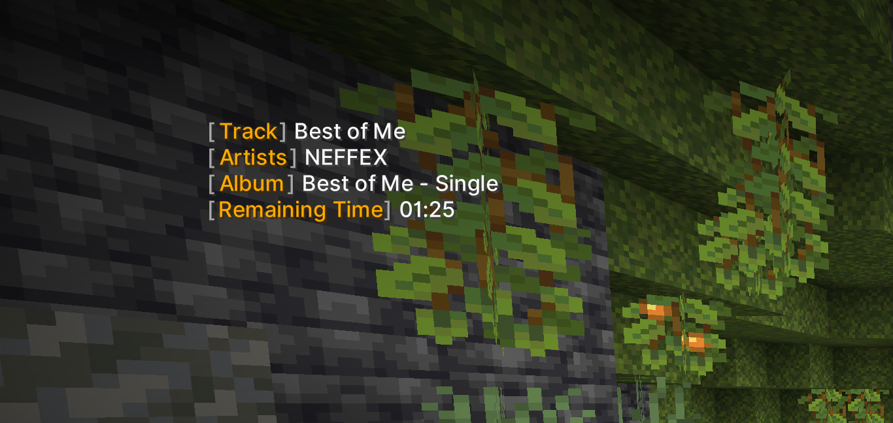

# LabyMod Music Info Addon

This small addon features a small music info widget, which displays you what song you're listing to!
It can show you:
- track name
- artists
- album
- duration
- play time
- remaining time

Coming soon:
- cover widget

---

Right now, the following services are supported:
- [Cider Classic](https://github.com/ciderapp/Cider)
- [Cider](https://cider.sh)
- [Every Jellyfin Client](https://jellyfin.org/)
- [Spotify](https://open.spotify.com/download)
- [beefweb](https://github.com/hyperblast/beefweb)
- [Tidal](https://offer.tidal.com/download)

---
## Jellyfin

You need to specify the server URL, the username and a password / auth token in order for the addon to work with Jellyfin.
Moreover, it's highly recommended to supply a client name to prevent the game to display music you hear on a different device. You can list all valid client names in the Jellyfin Admin Dashboard.
And don't forget to generate an auth token (possible in the settings), if you only supply a password!

---

## Legal Note

In order to work, it uses the [Jukebox by ThatGravyBoat](https://github.com/ThatGravyBoat/Jukebox), licensed under [MIT](https://github.com/ThatGravyBoat/Jukebox/blob/master/LICENSE.md).